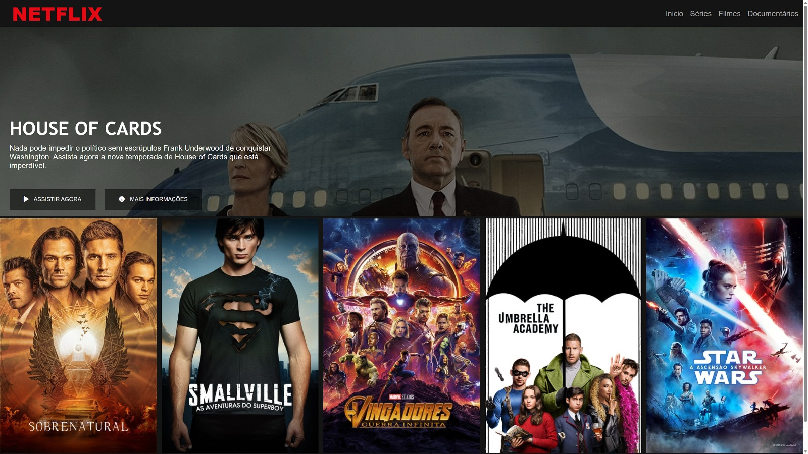

# Recriando a Tela da Netflix usando angular, html, css, js.
## Link do site no netlify :  [click aqui](https://clone-do-netflix-franklyn.netlify.app/)

Este é um projeto de página de entrada (landing page) que recria a tela inicial da plataforma de streaming Netflix. Foi desenvolvido com as tecnologias Angular, HTML, CSS e JS, com o objetivo de demonstrar as habilidades do desenvolvedor em construir interfaces de usuário responsivas e dinâmicas.

A página apresenta um layout moderno e atraente, que inclui imagens e informações sobre os principais títulos disponíveis na Netflix.

Para a criação da interface e manipulação de dados, foi utilizado o framework Angular, além de HTML e CSS para o design da página e JS para a implementação de recursos interativos e animações.

Para executar o projeto em sua máquina local, é necessário ter o Node.js e o Angular CLI instalados. Após baixar os arquivos do repositório, basta executar o comando "ng serve" no terminal para iniciar o servidor local e visualizar a página no navegador.

Esperamos que este projeto possa ser inspirador e útil para outros desenvolvedores que desejam aprimorar suas habilidades em front-end. Fique à vontade para contribuir com novas funcionalidades ou melhorias e compartilhar seus comentários e sugestões conosco!
